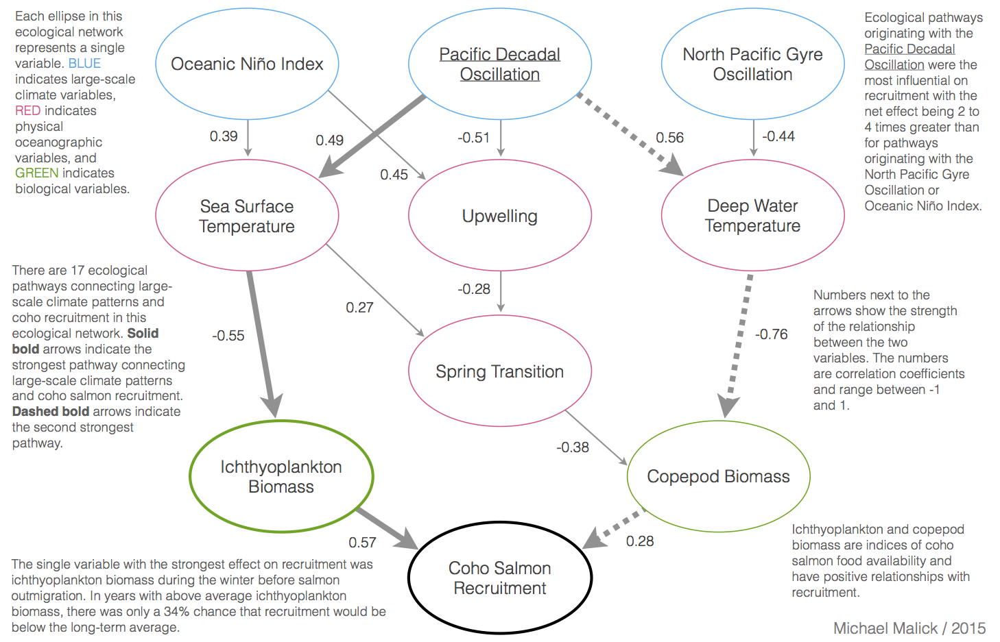

---

layout: default
title: Michael Malick | Research

---

# Research

<!-- Bayesian Network --------------------------------------------------------->

<h1 style="margin-top:40px"></h1>

    <a href="./bayes-network/index.html">Accounting for multiple pathways in the
    connections among climate variability, ocean processes, and coho salmon
    recruitment in the Northern California Current</a>   
  

<h1 style="margin-top:20px"></h1>
In this study, we investigated how multiple ecological pathways potentially link
climate and oceanographic processes to wild Oregon coho salmon (*Oncorhynchus
kisutch*) recruitment...

<!-- Pink salmon and spring bloom --------------------------------------------->

<h1 style="margin-top:75px"></h1>

    <a href="./spring-bloom/index.html">Linking phytoplankton phenology to salmon productivity along a north/south gradient</a>  
  

<h1 style="margin-top:20px"></h1>
We analyzed the effects of the spring bloom timing on pink salmon productivity
(adults produced per spawner) in the Northeast Pacific Ocean to better
understand the mechanisms...

