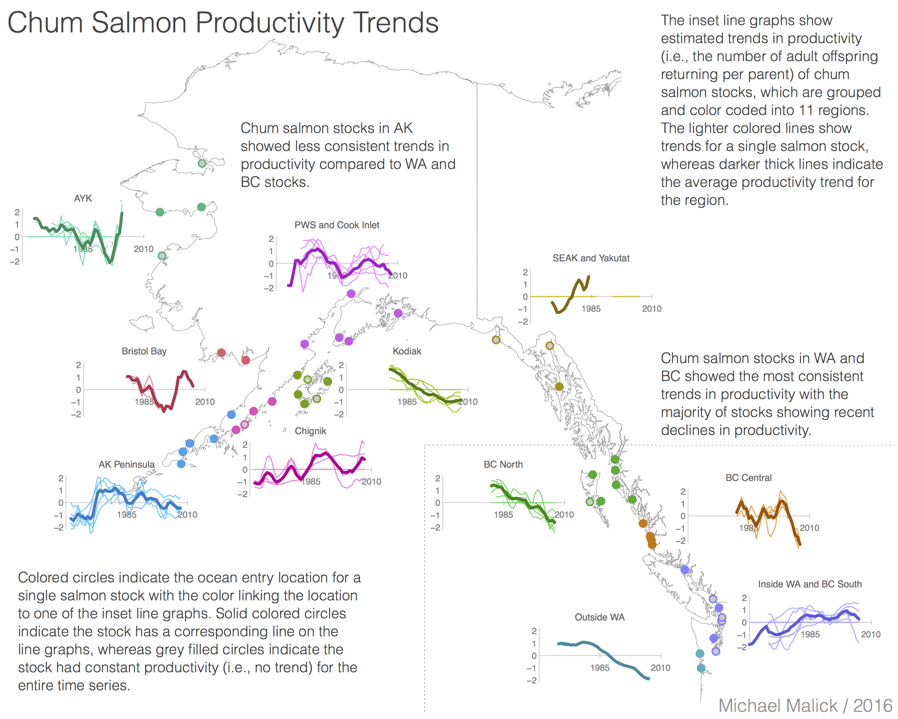
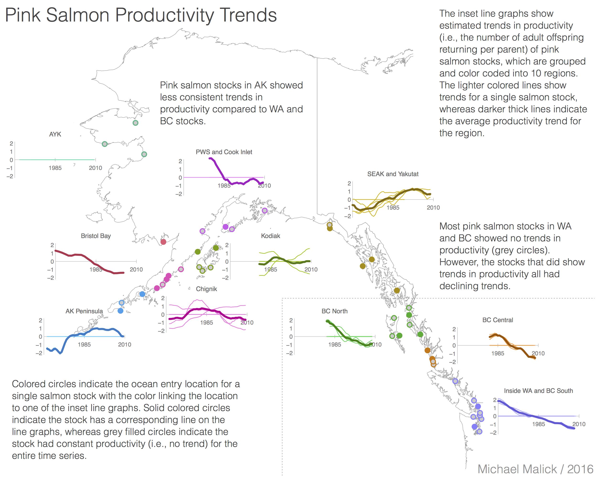

---

layout: default
title: Salmon Productivity Trends

---

# Regional-scale declines in productivity of pink and chum salmon stocks in western North America 

In this study, we tested the hypothesis that North American pink (*Oncorhynchus
gorbuscha*) and chum (*O. keta*) salmon stocks have experienced recent declines
in productivity (i.e., the number of adult recruits returning per spawner) by
investigating temporal and spatial trends in productivity of 99 wild North
American pink and chum salmon stocks. We used a combination of population
dynamics and time series models to quantify individual stock trends as well as
common temporal trends in pink and chum salmon productivity across local,
regional, and continental spatial scales. 

<!--

-->

Our results indicated widespread declines in productivity of wild chum salmon
stocks throughout Washington (WA) and British Columbia (BC) with 81% of stocks
showing recent declines in productivity, although the exact form of the trends
varied among regions. For pink salmon, the majority of stocks in WA and BC (65%)
did not have strong temporal trends in productivity; however, all stocks that
did have trends in productivity showed declining productivity since at least
brood year 1996. We found weaker evidence of widespread declines in productivity
for Alaska pink and chum salmon, with some regions and stocks showing declines
in productivity (e.g., Kodiak chum salmon stocks) and others showing increases
(e.g., Alaska Peninsula pink salmon stocks). We also found strong positive
covariation between stock productivity series at the regional spatial scale for
both pink and chum salmon, along with evidence that this regional-scale positive
covariation has become stronger since the early 1990s in WA and BC. In general,
our results suggest that common processes operating at the regional or
multi-regional spatial scales drive productivity of pink and chum salmon stocks
in western North America and that the effects of these process on productivity
may change over time.

**Citation** Malick, M.J. and S.P. Cox. 2016. Regional-scale declines in
productivity of pink and chum salmon stocks in western North America. PLoS
ONE 11:e0146009. ([PDF][Malick:2016]) 
<http://doi.org/10.1371/journal.pone.0146009>

[Malick:2016]: https://dl.dropboxusercontent.com/u/43909530/papers/malick_cox_2016.pdf
